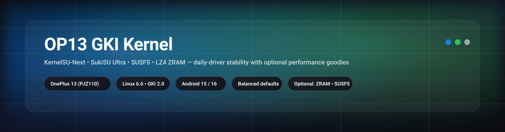

<!--
  OP13 GKI Kernel — README
  Repo: ox1d3x3/Op13_Susfs_kernel
-->

<div align="center">

<!-- Apple-like hero banner (add file to your repo at: .github/assets/hero.svg) -->


<br/>

<!-- Sleek live badges -->
<a href="https://github.com/ox1d3x3/Op13_Susfs_kernel/releases">
  
</a>
<a href="https://github.com/ox1d3x3/Op13_Susfs_kernel/releases">
  
</a>
<a href="https://github.com/ox1d3x3/Op13_Susfs_kernel/commits">
  
</a>

<br/>


</div>

---

## What this is

**OP13 GKI Kernel** is a daily‑driver focused **Android 15/16 • Linux 6.6 GKI 2.0** kernel for **OnePlus 13 (sm8750 / “sun”)**.

This repo publishes **two kernel variants**:

- **KernelSU‑Next** builds  
- **SukiSU Ultra** builds (builtin)

Most releases are tuned as a **stable “Balanced/Stock‑like” baseline**, with optional extras depending on the release notes.

➡️ **Downloads (Releases):** https://github.com/ox1d3x3/Op13_Susfs_kernel/releases

---

## Variants (what to pick)

| Variant | Best for | Notes |
|---|---|---|
| **KernelSU‑Next** | KernelSU‑Next users / compatibility | Classic KSU‑Next experience |
| **SukiSU Ultra (builtin)** | Ultra users / modern KSU stack | Uses SukiSU Ultra builtin integration |

> If you switch between variants: **reinstall the SUSFS module** after flashing (to avoid old module state/caches).

---

## Features

### Core (always)
- **GKI‑compatible** packaging (AnyKernel3 flashable ZIP)
- **Stability‑first defaults** (daily driver)
- **Root framework**: KernelSU‑Next *or* SukiSU Ultra (depends on release)
- **SUSFS v2 (inline hook)**
- **ADIOS I/O scheduler**
- **Baseband‑Guard (BBG)**
- **Netfilter extras**: TTL target/match, IP_SET

### Optional (depends on release notes)
- **ZRAM + LZ4** (and optional ZRAM/LZ4 performance patch)
- **TCP congestion control**: optional BBR
- **HMBIRD / FengChi scheduler bundle** *(best‑effort; your base may already include parts of it)*

✅ **Source of truth:** each release’s notes/changelog.

---

## Safety first

### Warning / No warranty
Flashing kernels can cause **bootloops**, **soft‑bricks**, **data loss**, and **instability**.  
You are responsible for what you flash.

If you’re not comfortable recovering from a bootloop, **do not flash**.

### Backup (do this first)
In recovery, back up:
- **boot**
- **init_boot**
- *(optional)* **vbmeta** (depending on your setup)

If you bootloop:
1. Reboot to recovery 
3. **Restore boot/init_boot** from your backup (If recovery not working, flash stock boot.img then reboot to recovery)  
4. Reboot  

---

## Install guide (AnyKernel3 ZIP)

### Recommended (Recovery / Kernel flasher)
1. Download the correct ZIP from **Releases**
2. Flash with kernel flasher or Suki/KSU build in Anykernel3 flasher
3. Reboot
4. Enjoy

## Force use LZ4
1. Download the "X1 Kernel Manager"sub-module from the release
2. Flash it, Reboot the device
3. Open the module and select "Force Lz4" apply and reboot

---

## Post‑flash verification (quick checks)

### Kernel version
```sh
uname -a
```

### ZRAM + compressor
```sh
su -c 'ls -l /sys/block | grep zram || true'
su -c 'cat /sys/block/zram0/comp_algorithm 2>/dev/null || true'
su -c 'cat /proc/swaps || true'
```

### SUSFS flags (kernel-side)
```sh
su -c 'zcat /proc/config.gz | grep -E "CONFIG_(KSU|KSU_SUSFS|KSU_SUSFS_TRY_UMOUNT|KSU_SUSFS_SPOOF_UNAME|KSU_SUSFS_(CMDLINE|BOOTCONFIG))" || true'
```

> **Tip:** if SUSFS module shows “operation not supported”, reinstall the module after flashing a different variant/build.

---

## Troubleshooting

### SUSFS module error (0x555e1 / “operation not supported”)
- Reinstall your SUSFS module after flashing
- If you had a different SUSFS module before: uninstall it, reboot, then install the correct one

### `zram.ko` not found
Sometimes ZRAM is compiled **built‑in** (no `zram.ko`).  
Use the runtime checks above instead of relying on a `.ko` file.

### Bootloop
- Restore **boot/init_boot** backups
- Return to a known‑good baseline (Balanced/Stock‑like) and re‑apply changes one‑by‑one

---

## Build your own (optional)
If you want experimental toggles/profiles, fork the repo and build with your preferred options.

---

## Credits
- https://github.com/xiaomichael
- https://github.com/cctv18
- https://github.com/vc-teahouse
- https://github.com/Numbersf
- https://github.com/mrcxlinux
- https://github.com/WildKernels

---

## License
This repo distributes kernel builds and build glue.  
Follow upstream kernel sources and patch project licenses where applicable.
